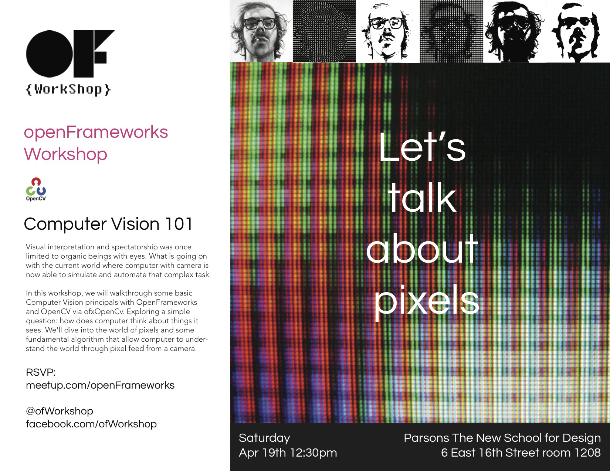

#openFrameworks workshop - Computer Vision

http://www.meetup.com/openFrameworks/events/175895252/  

Visual interpretation and spectatorship was once limited to organic beings with eyes. What is going on with the current world where computer with camera is now able to simulate and automate that complex task.    

In this workshop, we will walkthrough some basic Computer Vision principals with OpenFrameworks and OpenCV via ofxOpenCv. Exploring a simple question: how does computer think about things it sees. We'll dive into the world of pixels and some fundamental algorithm that allow computer to understand the world through pixel feed from a camera.    
We are looking for all OF enthusiasts to join us. We will continually run OF workshop every couple weeks. If you want to learn or run a workshop on any topic about OF, feel free to get in touch with us, we will try our best to facilitate everyone's interest.     

Special Thanks: This event is supported by Design and Technology, Parsons The New School for Design. 
  
  
  
derived from :  
https://github.com/ofZach/sfpc_image_cv    
https://github.com/ofZach/avsys2012  
  

NOTE: this repo is designed to be put inside 'apps' folder  